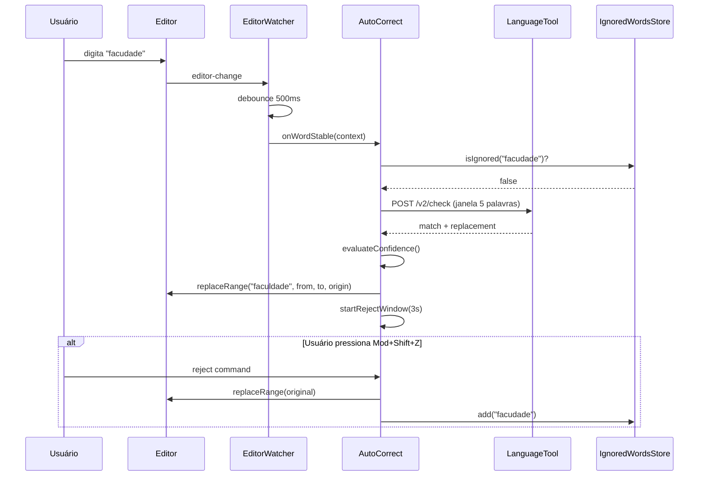
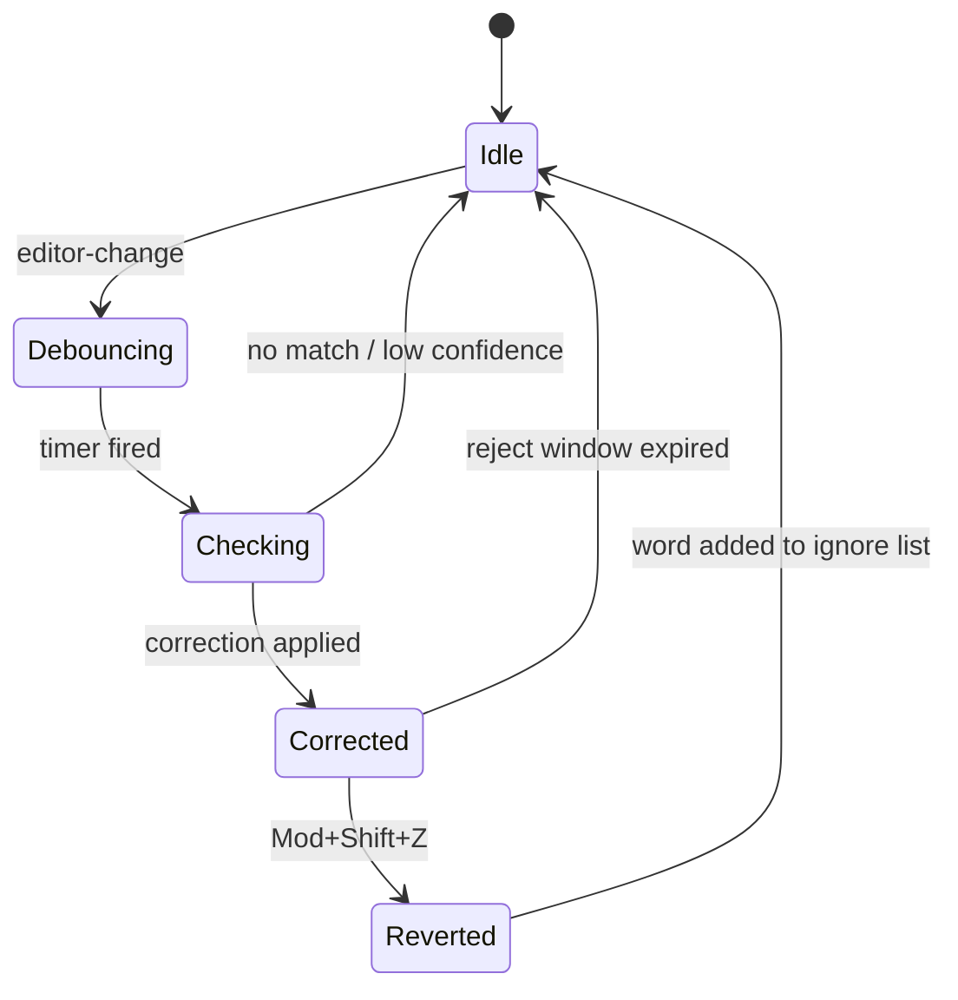

# 02 — Arquitetura do Sistema

## 1. Visão geral

```
┌─────────────────────────────────────────────────────────────────┐
│                        Obsidian App                              │
│  ┌──────────────┐    ┌─────────────────┐    ┌────────────────┐ │
│  │ MarkdownView │───▶│  EditorWatcher  │───▶│   AutoCorrect  │ │
│  │   (Editor)   │◀───│  (debounce)     │◀───│   (orquestra)  │ │
│  └──────────────┘    └─────────────────┘    └───────┬────────┘ │
│                                                      │          │
│  ┌──────────────┐    ┌─────────────────┐           │          │
│  │   Settings   │◀───│  Plugin Main    │◀──────────┘          │
│  │     Tab      │    │  (onload)       │                       │
│  └──────────────┘    └────────┬────────┘                       │
│                               │                                 │
│                    ┌──────────▼──────────┐                     │
│                    │ IgnoredWordsStore   │                     │
│                    │ (persistência)      │                     │
│                    └─────────────────────┘                     │
└───────────────────────────────┬─────────────────────────────────┘
                                │ HTTP POST /v2/check
                                ▼
                    ┌───────────────────────┐
                    │  LanguageTool Docker  │
                    │  localhost:8010       │
                    └───────────────────────┘
```

---

## 2. Componentes

### 2.1 `main.ts` — Plugin entry point

**Responsabilidade:** Bootstrap, registro de eventos, comandos, settings tab, ciclo de vida.

**Ações no `onload`:**
- Carregar settings e dicionário de ignorados
- Instanciar `LanguageToolClient`, `AutoCorrect`, `EditorWatcher`
- Registrar `workspace.on('editor-change')`
- Registrar comando `reject-last-correction` (`Mod+Shift+Z`)
- Adicionar settings tab

**Ações no `onunload`:**
- Cancelar timers e requests pendentes
- Destruir watchers

### 2.2 `EditorWatcher.ts` — Detecção de digitação

**Responsabilidade:** Observar mudanças no editor, extrair última palavra, debounce.

**Entrada:** evento `editor-change(editor, info)`
**Saída:** callback `onWordStable(context: EditorContext)`

```typescript
interface EditorContext {
  editor: Editor;
  fullText: string;           // documento completo (para offsets)
  contextText: string;        // janela enviada ao LT
  contextStartOffset: number; // offset absoluto do início da janela
  targetWord: string;         // última palavra
  targetWordStart: number;    // offset absoluto início da palavra
  targetWordEnd: number;      // offset absoluto fim da palavra
  cursorOffset: number;
}
```

**Regras:**
- Ignorar eventos quando `info.origin === PLUGIN_ORIGIN` (evitar loop)
- Ignorar quando `info.docChanged === false`
- Cancelar debounce anterior a cada keystroke

### 2.3 `LanguageToolClient.ts` — Cliente HTTP

**Responsabilidade:** Comunicação com LanguageTool, parse de resposta, cancelamento.

**Métodos:**
- `check(text, options): Promise<CheckResult>`
- `healthCheck(): Promise<boolean>`
- `abortPending(): void`

Usa `fetch` com `AbortController`. Timeout padrão: 2000 ms.

### 2.4 `AutoCorrect.ts` — Orquestrador de correção

**Responsabilidade:** Decidir se corrige, aplicar `replaceRange`, gerenciar janela de rejeição.

**Fluxo interno:**
1. Recebe `EditorContext`
2. Verifica `ignoredWords` → aborta se palavra ignorada
3. Chama `LanguageToolClient.check`
4. Filtra matches para a última palavra
5. Avalia alta confiança
6. Aplica correção ou descarta
7. Registra `LastCorrection` para rejeição

### 2.5 `IgnoredWordsStore.ts` — Persistência

**Responsabilidade:** CRUD do dicionário de ignorados via `this.loadData()` / `this.saveData()`.

**Operações:**
- `isIgnored(word: string): boolean`
- `add(word: string): void`
- `remove(word: string): void` (para settings UI)
- `getAll(): string[]`

Comparação **case-insensitive** para português/inglês comum.

### 2.6 `ConfidenceEvaluator.ts` — Heurísticas

**Responsabilidade:** Calcular score 0–1 e boolean `isHighConfidence`.

Ver [03-business-rules.md](03-business-rules.md#3-regras-de-alta-confiança).

### 2.7 `Settings.ts` — Configuração

**Responsabilidade:** Interface `PluginSettings`, defaults, `PluginSettingTab`.

---

## 3. Fluxo de dados principal



---

## 4. Fluxo de rejeição e aprendizado



**Estado `LastCorrection`:**

```typescript
interface LastCorrection {
  original: string;
  replacement: string;
  from: EditorPosition;
  to: EditorPosition;
  editor: Editor;
  timestamp: number;
  expiresAt: number;
}
```

Somente **uma** correção pendente de rejeição por vez (a mais recente).

---

## 5. Prevenção de loops

| Mecanismo | Onde |
|-----------|------|
| `origin = 'languagetool-autocorrect'` em `replaceRange` | AutoCorrect |
| `EditorWatcher` ignora `info.origin === PLUGIN_ORIGIN` | EditorWatcher |
| Flag `isApplyingCorrection` (mutex) | AutoCorrect |
| Dicionário de ignorados | IgnoredWordsStore |
| Não re-disparar se texto já igual ao replacement | AutoCorrect |

---

## 6. Extração da janela de contexto

**Estratégia padrão:** últimas N palavras (configurável, padrão 5).

```
Documento: "Hoje fui na facudade"
                              ^^^^^^^^
Janela enviada: "fui na facudade"  (5 palavras)
targetWord: "facudade"
```

**Algoritmo:**
1. Obter `cursorOffset` via `editor.posToOffset(editor.getCursor())`
2. Extrair texto até o cursor (não incluir texto após cursor)
3. Tokenizar por `\b` (word boundaries Unicode)
4. `targetWord` = último token alfanumérico
5. `contextText` = últimos `contextWordCount` tokens + espaços
6. Calcular `contextStartOffset` = cursorOffset - contextText.length

**Alternativa (fallback):** se < 2 palavras, usar texto desde o início da sentença atual (delimitadores: `.` `!` `?` `\n`).

---

## 7. Mapeamento de offsets

LanguageTool retorna `offset` relativo ao **texto enviado** (`contextText`).

```
absoluteOffset = contextStartOffset + match.offset
absoluteEnd    = absoluteOffset + match.length
from           = editor.offsetToPos(absoluteOffset)
to             = editor.offsetToPos(absoluteEnd)
```

**Validação obrigatória antes de corrigir:**
- `editor.getRange(from, to) === match.originalText` (texto no editor coincide)
- Match sobrepõe `targetWord` (interseção de ranges)

---

## 8. Tratamento de erros

| Erro | Comportamento |
|------|---------------|
| `ECONNREFUSED` / timeout | Log debug; sem correção; sem modal |
| HTTP 4xx/5xx | Log debug; sem correção |
| JSON inválido | Log error; sem correção |
| Múltiplos matches conflitantes | Não corrigir |
| Cursor mudou durante request | Descartar resposta (stale) |

---

## 9. Decisões arquiteturais (ADRs)

### ADR-001: Usar `Editor` API em vez de CodeMirror direto

**Contexto:** Obsidian abstrai CM5/CM6 via `Editor`.  
**Decisão:** Usar apenas `Editor` para compatibilidade.  
**Consequência:** Sem decorações visuais na v1 (aceitável pelo escopo).

### ADR-002: Heurísticas locais para confiança

**Contexto:** API local do LanguageTool não retorna score por replacement.  
**Decisão:** `ConfidenceEvaluator` com regras compostas.  
**Consequência:** Tunável via `minConfidenceScore` nas settings.

### ADR-003: Uma correção pendente de rejeição

**Contexto:** Simplifica UX e estado.  
**Decisão:** Apenas `LastCorrection` mais recente é rejeitável.  
**Consequência:** Correções rápidas em sequência substituem a pendente.

### ADR-004: Persistência via `loadData/saveData`

**Contexto:** Padrão Obsidian para plugins.  
**Decisão:** Armazenar settings + ignoredWords em um único JSON.  
**Consequência:** Sem dependência de IndexedDB ou arquivos no vault.
