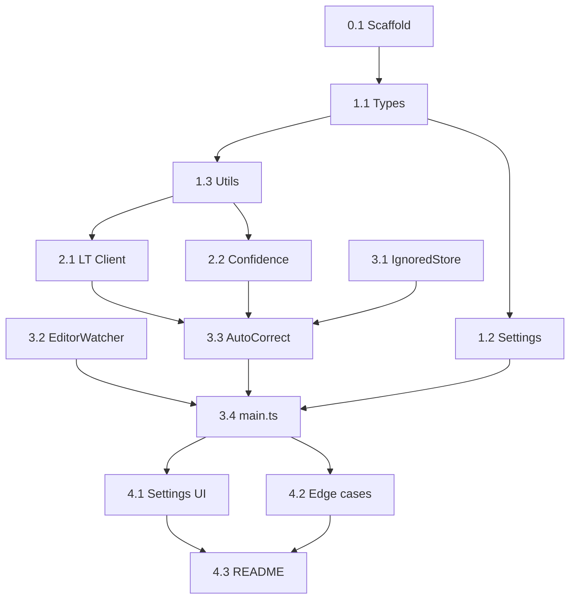

# 07 — Plano de Implementação

Este documento define a **ordem exata** de tarefas para o Cursor implementar o plugin. Cada tarefa referencia a documentação necessária e possui critérios de conclusão verificáveis.

**Regra:** Implementar **somente** as 5 funcionalidades do escopo. Não adicionar features extras.

---

## Fase 0 — Bootstrap do projeto

### Tarefa 0.1 — Scaffold do plugin Obsidian

**Referências:** [05-obsidian-api.md](05-obsidian-api.md), [06-project-structure.md](06-project-structure.md)

**Ações:**
1. Clonar ou copiar estrutura do [obsidian-sample-plugin](https://github.com/obsidianmd/obsidian-sample-plugin)
2. Renomear para `languagetool-autocorrect`
3. Configurar `manifest.json`, `package.json`, `tsconfig.json`, `esbuild.config.mjs`
4. Criar estrutura `src/` conforme doc 06
5. `npm install` && `npm run build` sem erros

**Concluído quando:** Plugin aparece na lista de plugins do Obsidian (mesmo sem funcionalidade).

---

## Fase 1 — Fundação

### Tarefa 1.1 — Types e constants

**Referências:** [06-project-structure.md](06-project-structure.md)

**Arquivos:** `src/types.ts`, `src/constants.ts`

**Concluído quando:** Todos os tipos compilam; `DEFAULT_SETTINGS` e `AMBIGUOUS_WORDS` exportados.

---

### Tarefa 1.2 — Settings e persistência

**Referências:** [01-product-requirements.md](01-product-requirements.md#4-configurações-do-usuário), [05-obsidian-api.md](05-obsidian-api.md#7-persistência-de-dados)

**Arquivos:** `src/settings.ts`, atualizar `src/main.ts`

**Ações:**
- `loadSettings()` / `saveSettings()` com merge de defaults
- `LTSettingTab` com todos os campos da doc 06 seção 9
- Botão "Test connection" chamando health check (stub por enquanto)

**Concluído quando:** Settings persistem após reload do Obsidian.

---

### Tarefa 1.3 — Utils de texto

**Referências:** [02-system-architecture.md](02-system-architecture.md#6-extração-da-janela-de-contexto), [03-business-rules.md](03-business-rules.md#3-regras-de-alta-confiança)

**Arquivos:** `src/utils/text.ts`, `src/utils/context.ts`

**Ações:**
- `extractLastWords()` com testes manuais
- `normalizedLevenshteinSimilarity()`
- `rangesIntersect()`, `clamp()`
- `resolveLanguageParam()`, `normalizeDetectedLanguage()`
- `isInsideCodeBlock()`, `isInsideInlineCode()`

**Concluído quando:** Funções exportadas e usáveis; edge cases básicos tratados.

---

## Fase 2 — LanguageTool

### Tarefa 2.1 — LanguageToolClient

**Referências:** [04-languagetool-integration.md](04-languagetool-integration.md)

**Arquivo:** `src/LanguageToolClient.ts`

**Ações:**
- `check()` com URLSearchParams
- AbortController + timeout 2s
- `abortPending()` para cancelar request anterior
- `healthCheck()` via POST com `text=test`
- `LanguageToolError` para erros HTTP

**Concluído quando:** `curl` equivalente funciona via client; servidor offline não lança exceção não tratada.

---

### Tarefa 2.2 — ConfidenceEvaluator

**Referências:** [03-business-rules.md](03-business-rules.md#3-regras-de-alta-confiança)

**Arquivo:** `src/ConfidenceEvaluator.ts`

**Ações:**
- Implementar `calculateConfidence()` conforme fórmula da doc 03
- `isHighConfidence` quando `score >= minScore` e critérios C1–C5

**Concluído quando:**
- `facudade` → `faculdade` = high confidence
- `esta` → `está` = low confidence (ambígua)

---

## Fase 3 — Core do plugin

### Tarefa 3.1 — IgnoredWordsStore

**Referências:** [03-business-rules.md](03-business-rules.md#9-palavras-ignoradas--ciclo-de-vida)

**Arquivo:** `src/IgnoredWordsStore.ts`

**Concluído quando:** add/remove/isIgnored funcionam case-insensitive; lista serializável.

---

### Tarefa 3.2 — EditorWatcher

**Referências:** [02-system-architecture.md](02-system-architecture.md#22-editorwatcherts--detecção-de-digitação), [03-business-rules.md](03-business-rules.md#1-quando-disparar-verificação)

**Arquivo:** `src/EditorWatcher.ts`

**Ações:**
- Debounce configurável
- Ignorar `PLUGIN_ORIGIN`
- Ignorar seleção ativa
- Extrair `EditorContext`
- `destroy()` limpa timer

**Concluído quando:** Callback dispara 500ms após parar de digitar; cancela em nova digitação.

---

### Tarefa 3.3 — AutoCorrect (orquestrador)

**Referências:** [02-system-architecture.md](02-system-architecture.md), [03-business-rules.md](03-business-rules.md)

**Arquivo:** `src/AutoCorrect.ts`

**Ações:**
1. Verificar `ignoredStore.isIgnored(targetWord)` → skip
2. Chamar `ltClient.check(contextText, language)`
3. Validar `requestGeneration` (stale check)
4. Filtrar matches para targetWord
5. Avaliar confiança
6. `replaceRange` com `PLUGIN_ORIGIN`
7. Registrar `lastCorrection`
8. Implementar `rejectLastCorrection()`

**Concluído quando:** CA-01 a CA-04 do PRD passam manualmente.

---

### Tarefa 3.4 — Integração em main.ts

**Referências:** [06-project-structure.md](06-project-structure.md#8-maints--esqueleto)

**Arquivo:** `src/main.ts`

**Ações:**
- Wire de todos os componentes
- `registerEvent(editor-change)`
- Comando `reject-last-correction`
- Cleanup em `onunload`

**Concluído quando:** Plugin funcional end-to-end no Obsidian.

---

## Fase 4 — Polimento

### Tarefa 4.1 — Settings tab completa

**Referências:** [06-project-structure.md](06-project-structure.md#9-settings-ui--campos)

**Ações:**
- Lista de palavras ignoradas com remoção
- Botão test connection funcional
- Texto explicativo Mod+Shift+Z vs Ctrl+Z
- Atualizar `debounceMs` / `contextWordCount` em runtime no watcher

**Concluído quando:** Todas as settings da doc 01 seção 4 funcionam.

---

### Tarefa 4.2 — Tratamento de erros e edge cases

**Referências:** [02-system-architecture.md](02-system-architecture.md#8-tratamento-de-erros), [04-languagetool-integration.md](04-languagetool-integration.md#7-tratamento-de-erros-http)

**Ações:**
- Servidor offline → silencioso
- Cursor moveu durante request → descartar
- Múltiplos matches → não corrigir
- `isApplyingCorrection` mutex

**Concluído quando:** CA-06 passa; sem loops de correção.

---

### Tarefa 4.3 — README do plugin

**Arquivo:** `README.md` (raiz do plugin, não docs/)

**Conteúdo:**
- O que o plugin faz (5 features)
- Pré-requisito Docker LanguageTool
- Como instalar
- Atalho Mod+Shift+Z
- Link para esta especificação

---

## Ordem de dependências



---

## Prompts sugeridos para o Cursor (copiar e colar)

### Prompt 1 — Bootstrap

```
Leia docs/06-project-structure.md e docs/05-obsidian-api.md.
Crie o scaffold completo do plugin Obsidian em src/ com manifest.json,
package.json, tsconfig.json e esbuild.config.mjs baseados no
obsidian-sample-plugin. Não implemente lógica de correção ainda.
```

### Prompt 2 — LanguageTool + Confidence

```
Leia docs/04-languagetool-integration.md e docs/03-business-rules.md.
Implemente LanguageToolClient.ts e ConfidenceEvaluator.ts conforme
a especificação. Inclua tratamento de erros e cancelamento.
```

### Prompt 3 — Core

```
Leia docs/02-system-architecture.md e docs/03-business-rules.md.
Implemente EditorWatcher.ts, IgnoredWordsStore.ts, AutoCorrect.ts
e integre em main.ts. Siga estritamente as regras de alta confiança
e o fluxo de rejeição com Mod+Shift+Z.
```

### Prompt 4 — Finalização

```
Leia docs/01-product-requirements.md seção 5 (critérios de aceite) e
docs/08-testing.md. Complete a settings tab, trate edge cases e
verifique todos os critérios de aceite CA-01 a CA-07.
```

---

## Estimativa de tempo

| Fase | Tempo estimado |
|------|----------------|
| Fase 0 | 30 min |
| Fase 1 | 1–2 h |
| Fase 2 | 1–2 h |
| Fase 3 | 2–3 h |
| Fase 4 | 1–2 h |
| **Total** | **6–10 h** |

Com Cursor em modo agente e esta especificação, expectativa realista: **1 sessão de tarde**.
